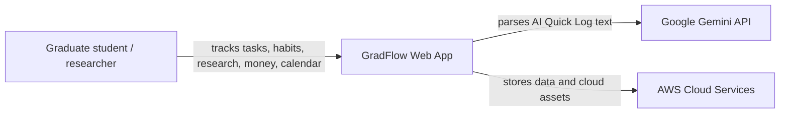
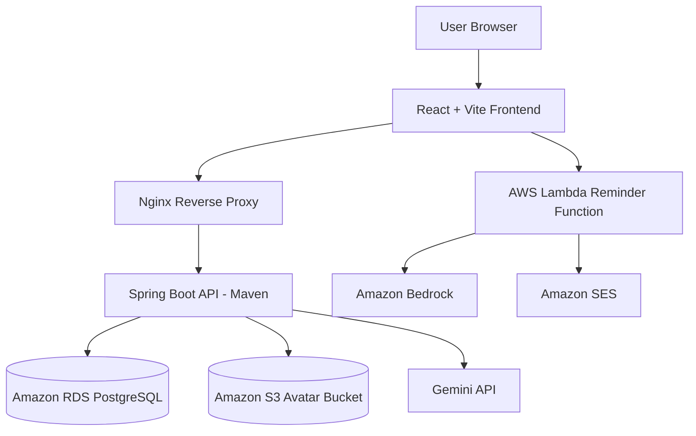
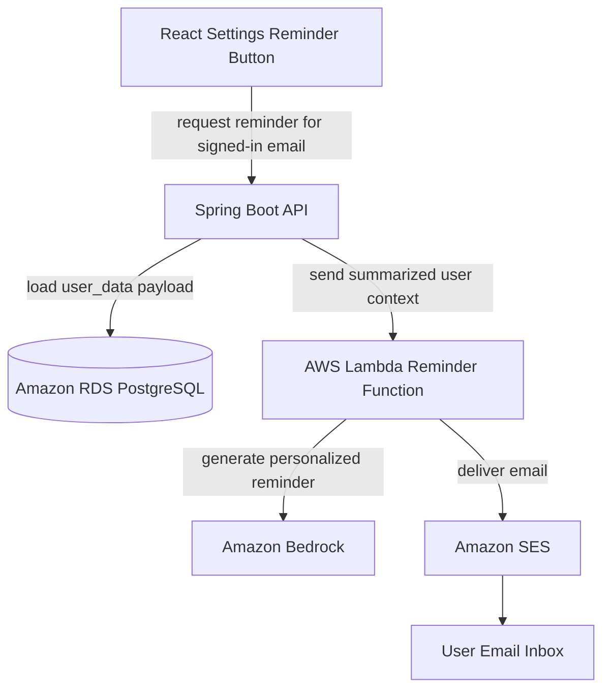
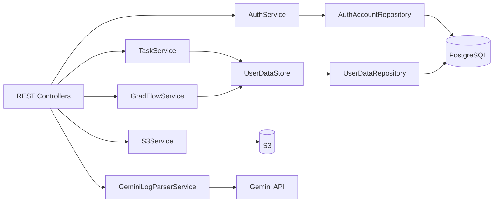
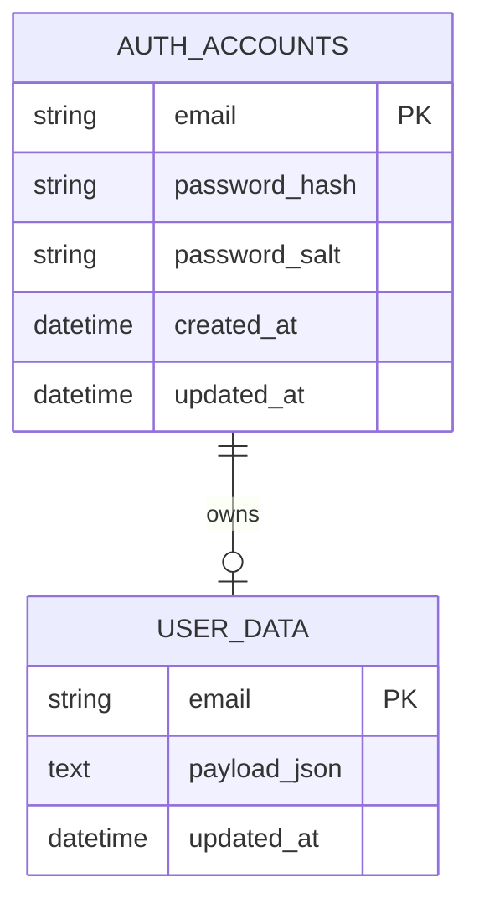
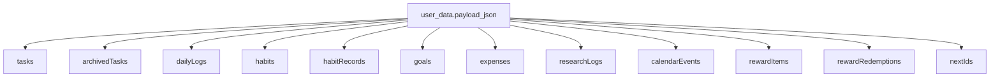

# GradFlow

GradFlow is a soft productivity dashboard designed for graduate students, researchers, and high-pressure academic life.

It combines task management, habit tracking, daily reflections, financial logging, research progress tracking, account-based data isolation, and cloud-integrated personalization into a single full-stack platform.

The project evolved from a local productivity app into a cloud-native deployment architecture using AWS services, Docker Compose, Nginx reverse proxy, Amazon RDS PostgreSQL, Amazon S3 object storage, and a Lambda-based reminder workflow with Bedrock and SES.

## Project Idea

Graduate work is rarely just a task list. Research progress is affected by sleep, stress, habits, money pressure, meetings, deadlines, and small routines. GradFlow tries to make those signals visible without turning the app into a rigid productivity system.

The core design goals are:

- Keep daily logging lightweight.
- Connect goals, habits, tasks, money, and calendar records.
- Support guest mode for quick demos.
- Support register/login account mode where each email has isolated data.
- Use AI as a logging assistant, not as a replacement for user confirmation.

## Demo Link
```text
http://54.65.20.129/
```


## Main Features

### Productivity & Research Tracking
- **Overview**: weekly analytics, quick signals, AI Quick Log.
- **Today**: daily check-in for sleep, mood, stress, study, water, exercise, and notes.
- **Tasks**: priority, effort, deadlines, suggestions, completion, archive.
- **Research**: research logs, blockers, next steps, and research-hour tracking.
- **Habits**: habit setup, daily habit records, streak-style statistics.
- **Rewards**: points earned from completed habits and redeemable reward items.
- **Money**: income/expense records, cash-flow range filter, category breakdown, transaction history, daily trend chart.
- **Goals**: manual progress plus automatic progress from linked tasks and habits.
- **Calendar**: month view combining deadlines, daily check-ins, research, money, rewards, and custom events.
- **Settings**: profile name, dark mode/theme, password update, avatar upload/crop/zoom/contrast, downloadable health report, and email reminder trigger.

### Cloud Features

- AWS EC2 deployment
- Docker Compose orchestration
- Nginx reverse proxy
- Amazon S3 avatar upload
- AWS Lambda reminder endpoint called from the frontend
- Amazon Bedrock reminder generation
- Amazon SES reminder email delivery
- IAM role-based S3 access from EC2/backend
- Production-ready multi-container architecture
- Amazon RDS PostgreSQL migration


## Architecture

### C4-Style System Context



### C4-Style Container View



The current reminder button calls a Lambda Function URL directly from the frontend. That Lambda workflow is separate from the Spring Boot backend, so it can generate and send a reminder email through Bedrock and SES, but it does not yet read the GradFlow user workspace from PostgreSQL.

### Planned Personalized Reminder Flow



This planned flow would let Bedrock write reminders based on the user's actual tasks, calendar events, goals, habits, and recent logs instead of sending a generic reminder.

### Backend Module View



## Data Storage Design

### Relational Tables



The database keeps authentication data relational and stores each user's productivity workspace as one JSON payload. This keeps the schema compact while still isolating data by email.

For personalized AI emails, this JSON payload design is convenient because the backend can load one user's entire workspace in one read and pass a curated summary to Bedrock. A fully normalized design with separate task, habit, calendar, and log tables would be better for complex SQL queries, filtering, reporting, and data integrity constraints, but it would require joining or assembling more records before generating an email.

### User Payload Shape



## Tech Stack

### Frontend

- React
- Vite
- JavaScript
- CSS

### Backend

- Java 17
- Spring Boot
- Maven

### Database

- PostgreSQL

### Infrastructure
- Docker Compose
- Nginx
- AWS EC2
- Amazon RDS PostgreSQL
- AWS S3
- AWS Lambda
- Amazon Bedrock
- Amazon SES
- AWS IAM

### AI Integration

- Gemini API through the backend service
- API key is loaded from environment variables
- The frontend never asks the user to paste the key
- The AI Quick Log flow asks Gemini to return structured JSON actions
- The UI turns those actions into natural-language confirmation before saving

## Account and Guest Data

Account mode uses the email as the user scope. Each account has credentials in `auth_accounts`, and its GradFlow workspace is saved in `user_data`, so two accounts using different emails should not see each other's records.

Guest mode is different: guest data is stored only in frontend memory. It appears while using the page, but disappears after refresh or reopening the app.

## Reminder Workflow

The Settings page includes a reminder button that calls an AWS Lambda Function URL. The Lambda side can use Amazon Bedrock to generate reminder content and Amazon SES to send the email.

In the current implementation, this reminder workflow is not yet connected to the Spring Boot API or `user_data` table. The next step for deeper personalization is to route the reminder request through the backend, load the signed-in user's payload, summarize the relevant data, and then pass that context to Lambda/Bedrock.


## Quick Start

### GitHub Pages Frontend Preview

This repository includes a GitHub Actions workflow for publishing the React frontend as a static GitHub Pages preview:

```text
.github/workflows/pages.yml
```

The Pages preview is frontend-only. It is useful for showing the UI and guest mode, but it does not run the Spring Boot backend or PostgreSQL database. For the full app, use Docker Compose locally or deploy the containers to AWS EC2.

### Demo Account

Seed data is attached to:

```text
Email: demo@gradflow.local
Password: demo1234
```

The demo account is created by the backend initializer, and the seed records live in PostgreSQL under `demo@gradflow.local`.

### Clone Repository

```bash
git clone https://github.com/shihyujhen/gradflow.git
cd gradflow
```

### Configure Environment Variables

Create a `.env` file:

```env
GEMINI_API_KEY=your_api_key
GEMINI_MODEL=gemini-2.5-flash
VITE_API_BASE_URL=/api
APP_CORS_ALLOWED_ORIGIN=http://localhost:80
DATABASE_URL=jdbc:postgresql://localhost:55432/gradflow
DATABASE_USERNAME=gradflow
DATABASE_PASSWORD=gradflow
```

### Start Containers

```bash
docker compose up --build
```

Then open:

```text
http://localhost
```

The current Compose setup also includes deployment-oriented values for the AWS/RDS environment. For a fully local database run, point the backend `DATABASE_URL` at the bundled `postgres` service or override it with your local PostgreSQL connection.

---

## AWS Deployment

For full AWS deployment instructions, infrastructure setup, IAM configuration, S3 integration, and deployment notes:

See:

```text
docs/aws-deployment.md
```

---

## Current AWS Integration

* EC2 deployment
* Dockerized frontend/backend/database
* Nginx reverse proxy
* Amazon RDS PostgreSQL storage
* S3 avatar upload
* Lambda-triggered reminder email workflow, currently separate from the backend database
* Bedrock-assisted reminder content
* SES email delivery
* IAM role-based S3 access from EC2/backend

---

## Planned Improvements

* GitHub Actions CI/CD
* CloudWatch logging integration
* HTTPS with ALB + ACM
* Lambda-based image processing
* Backend-connected personalized reminder emails using saved user data
* Presigned S3 upload URLs
* Sessions/JWT and stronger backend authorization
