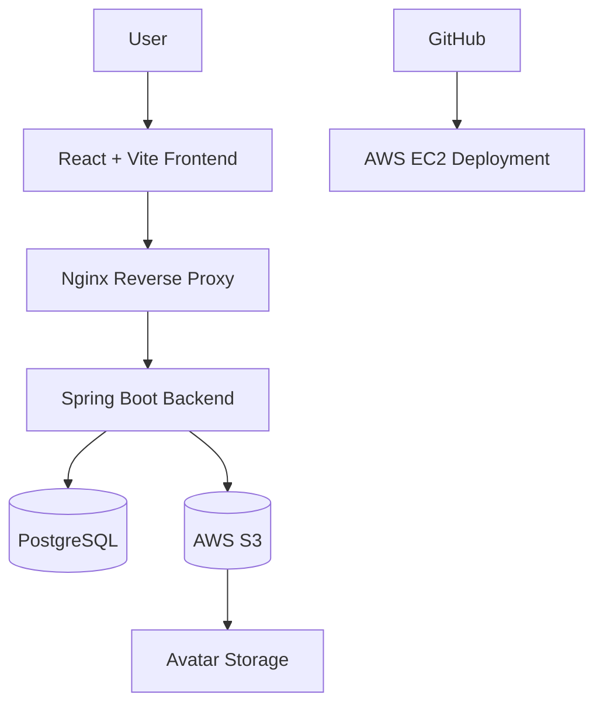

# GradFlow

GradFlow is a soft productivity dashboard designed for graduate students, researchers, and high-pressure academic life.

It combines task management, habit tracking, daily reflections, financial logging, research progress tracking, and cloud-integrated personalization into a single full-stack platform.

The project evolved from a local productivity app into a cloud-native deployment architecture using AWS services, Docker Compose, Nginx reverse proxy, and Amazon S3 object storage.

## Project Idea

Graduate work is rarely just a task list. Research progress is affected by sleep, stress, habits, money pressure, meetings, deadlines, and small routines. GradFlow tries to make those signals visible without turning the app into a rigid productivity system.

The core design goals are:

- Keep daily logging lightweight.
- Connect goals, habits, tasks, money, and calendar records.
- Support guest mode for quick demos.
- Support account mode where each email has isolated data.
- Use AI as a logging assistant, not as a replacement for user confirmation.

## Demo Link
```text
http://54.65.20.129/
```


## Main Features

### Productivity & Research Tracking
- **Overview**: weekly analytics, quick signals, AI Quick Log.
- **Today**: daily check-in for sleep, mood, stress, study, water, exercise, and notes.
- **Tasks**: priority, effort, deadlines, suggestions, completion, archive.
- **Research**: research logs, blockers, next steps, and research-hour tracking.
- **Habits**: habit setup, daily habit records, streak-style statistics.
- **Rewards**: points earned from completed habits and redeemable reward items.
- **Money**: income/expense records, cash-flow range filter, category breakdown, transaction history, daily trend chart.
- **Goals**: manual progress plus automatic progress from linked tasks and habits.
- **Calendar**: month view combining deadlines, daily check-ins, research, money, rewards, and custom events.
- **Settings**: profile name, password update, avatar upload/crop/zoom/contrast.

### Cloud Features

- AWS EC2 deployment
- Docker Compose orchestration
- Nginx reverse proxy
- Amazon S3 avatar upload
- IAM role-based AWS authentication
- Production-ready multi-container architecture


## Architecture



## Tech Stack

### Frontend

- React
- Vite
- JavaScript
- CSS

### Backend

- Java 17
- Spring Boot
- Gradle

### Database

- PostgreSQL

### Infrastructure
- Docker Compose
- Nginx
- AWS EC2
- AWS S3
- AWS IAM

### AI Integration

- Gemini API through the backend service
- API key is loaded from environment variables
- The frontend never asks the user to paste the key
- The AI Quick Log flow asks Gemini to return structured JSON actions
- The UI turns those actions into natural-language confirmation before saving

## Data Model

The backend stores records in user-scoped tables. Most user data includes:

- `userEmail`
- daily logs
- tasks
- archived tasks
- habits
- habit records
- goals
- rewards
- reward redemptions
- expenses
- research logs
- calendar events

This means two accounts using different emails should not see each other's records.

Guest mode is different: guest data is stored only in frontend memory. It appears while using the page, but disappears after refresh or reopening the app.


## Quick Start

### GitHub Pages Frontend Preview

This repository includes a GitHub Actions workflow for publishing the React frontend as a static GitHub Pages preview:

```text
.github/workflows/pages.yml
```

The Pages preview is frontend-only. It is useful for showing the UI and guest mode, but it does not run the Spring Boot backend or PostgreSQL database. For the full app, use Docker Compose locally or deploy the containers to AWS EC2.

### Demo Account

Seed data is attached to:

```text
Email: demo@gradflow.local
Password: demo1234
```

The password is a frontend demo-login password. The seed records themselves live in PostgreSQL under `demo@gradflow.local`.

### Clone Repository

```bash
git clone https://github.com/shihyujhen/gradflow.git
cd gradflow
```

### Configure Environment Variables

Create a `.env` file:

```env
GEMINI_API_KEY=your_api_key
GEMINI_MODEL=gemini-2.5-flash
VITE_API_BASE_URL=/api
APP_CORS_ALLOWED_ORIGIN=http://localhost:80
```

### Start Containers

```bash
docker compose up --build
```

Then open:

```text
http://localhost
```

---

## AWS Deployment

For full AWS deployment instructions, infrastructure setup, IAM configuration, S3 integration, and deployment notes:

See:

```text
docs/aws-deployment.md
```

---

## Current AWS Integration

* EC2 deployment
* Dockerized frontend/backend/database
* Nginx reverse proxy
* S3 avatar upload
* IAM role-based authentication

---

## Planned Improvements

* Amazon RDS PostgreSQL migration
* GitHub Actions CI/CD
* CloudWatch logging integration
* HTTPS with ALB + ACM
* Lambda-based image processing
* User authentication system
* Presigned S3 upload URLs
* Account creation, password hashing, sessions/JWT, and authorization fully into the backend.
