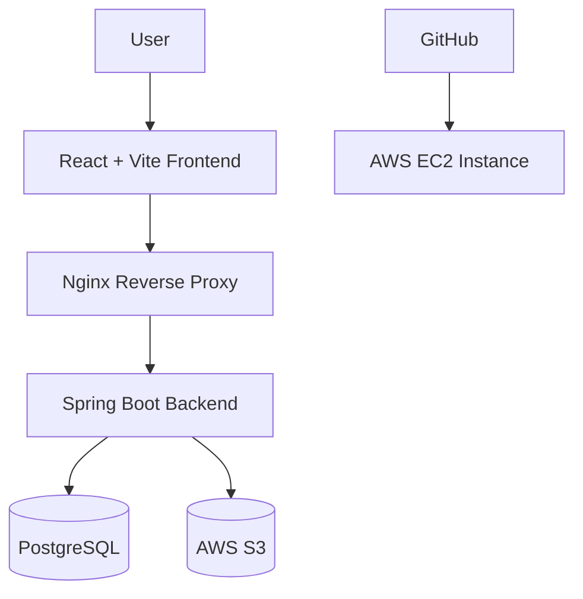

# AWS Deployment Guide

This document explains how to deploy GradFlow from scratch on AWS using:

* AWS EC2
* Docker Compose
* Nginx reverse proxy
* PostgreSQL
* AWS S3
* AWS IAM

The guide focuses on a practical single-EC2 deployment architecture suitable for learning, cloud practice, and further development.

---

# Architecture Overview



---

# Prerequisites

Before deployment, prepare:

* AWS account
* EC2 instance (Ubuntu recommended)
* Git installed locally
* SSH key pair (`.pem`)
* Docker & Docker Compose
* AWS S3 bucket
* AWS IAM role for EC2

---

# Recommended EC2 Setup

Recommended instance type:

```text
t3.small
```

Recommended OS:

```text
Ubuntu Server 24.04 LTS
```

Recommended inbound rules:

| Type       | Port            |
| ---------- | --------------- |
| SSH        | 22              |
| HTTP       | 80              |
| Custom TCP | 8082 (optional) |
| Custom TCP | 5180 (optional) |

---

# Connect to EC2

From local machine:

```bash
ssh -i your-key.pem ubuntu@YOUR_EC2_PUBLIC_IP
```

---

# Install Docker

```bash
sudo apt update

sudo apt install -y docker.io docker-compose-v2 git

sudo usermod -aG docker ubuntu
```

Reconnect SSH after installation.

Verify:

```bash
docker --version
docker compose version
```

---

# Clone Repository

```bash
git clone https://github.com/shihyujhen/gradflow.git

cd gradflow
```

---

# Environment Variables

Create `.env`:

```bash
nano .env
```

Example:

```env
GEMINI_API_KEY=your_api_key
GEMINI_MODEL=gemini-2.5-flash

VITE_API_BASE_URL=/api

APP_CORS_ALLOWED_ORIGIN=http://YOUR_EC2_PUBLIC_IP
```

---

# First-Time Database Initialization

For the first deployment only:

```properties
spring.sql.init.mode=always
```

This initializes seed/sample data.

After initialization succeeds, change it back to:

```properties
spring.sql.init.mode=never
```

Why?

Using `always` repeatedly may reinitialize database content or create duplicated seed entries depending on future schema logic.

File location:

```text
backend/src/main/resources/application.properties
```

---

# Start Containers

```bash
docker compose up --build -d
```

Check running containers:

```bash
docker ps
```

---

# Nginx Reverse Proxy

GradFlow uses Nginx as a reverse proxy.

Recommended configuration:

```nginx
server {
    listen 80;

    location / {
        proxy_pass http://gradflow-frontend:80;
    }

    location /api/ {
        proxy_pass http://gradflow-backend:8080;
    }
}
```

Important:

Container-to-container communication uses internal container ports, not host machine ports.

For example:

| Service  | Host Port | Container Port |
| -------- | --------- | -------------- |
| Frontend | 5180      | 80             |
| Backend  | 8082      | 8080           |

Nginx should use:

```text
gradflow-backend:8080
```

NOT:

```text
localhost:8082
```

inside Docker networking.

---

# AWS IAM Role Setup

Create an IAM role for EC2 with:

```text
AmazonS3FullAccess
```

(or a more restricted custom policy for production use).

Attach the IAM role to the EC2 instance.

This allows the backend to upload files to S3 without storing AWS access keys inside the repository.

---

# AWS S3 Bucket Setup

Create a bucket:

Example:

```text
gradflow-storage-yourname
```

Region recommendation:

```text
ap-northeast-1
```

---

# Public Access Configuration

If uploaded images should be viewable publicly (e.g. avatars), configure:

## Disable Block Public Access

Inside:

```text
S3 → Bucket → Permissions
```

Disable:

```text
Block all public access
```

---

# Bucket Policy

Example:

```json
{
  "Version": "2012-10-17",
  "Statement": [
    {
      "Sid": "PublicReadGetObject",
      "Effect": "Allow",
      "Principal": "*",
      "Action": "s3:GetObject",
      "Resource": "arn:aws:s3:::YOUR_BUCKET_NAME/*"
    }
  ]
}
```

---

# Common Pitfalls

## 1. Using Host Ports Inside Docker Networking

Incorrect:

```text
localhost:8082
```

Correct:

```text
gradflow-backend:8080
```

Inside Docker containers, use container names and internal ports.

---

## 2. Nginx Path Rewriting

Incorrect proxy configurations may accidentally create paths like:

```text
/api/api/tasks
```

Recommended:

```nginx
location /api/ {
    proxy_pass http://gradflow-backend:8080;
}
```

---

## 3. S3 AccessDenied Errors

If uploaded images return:

```xml
<Code>AccessDenied</Code>
```

The bucket likely does not allow public object reads.

Check:

* Block Public Access settings
* Bucket Policy

---

## 4. spring.sql.init.mode

Do not leave:

```properties
spring.sql.init.mode=always
```

enabled permanently after initialization.

---

# Useful Docker Commands

View logs:

```bash
docker compose logs -f
```

Restart containers:

```bash
docker compose restart
```

Rebuild everything:

```bash
docker compose down

docker compose up --build -d
```

---

# Current AWS Features

Current implemented AWS integrations:

* EC2 deployment
* Dockerized multi-container architecture
* Nginx reverse proxy
* S3 avatar upload
* IAM role-based authentication

---

# Suggested Future Improvements

Recommended next AWS upgrades:

* Amazon RDS PostgreSQL
* GitHub Actions CI/CD
* CloudWatch logging
* Application Load Balancer (ALB)
* HTTPS with ACM
* Lambda image processing
* Presigned S3 uploads
* Auto deployment pipeline

---

# Notes

This deployment architecture intentionally prioritizes:

* learning cloud-native deployment
* infrastructure understanding
* full-stack integration practice

over enterprise-scale optimization.

The project is expected to continue evolving with additional AWS services and DevOps workflows.
